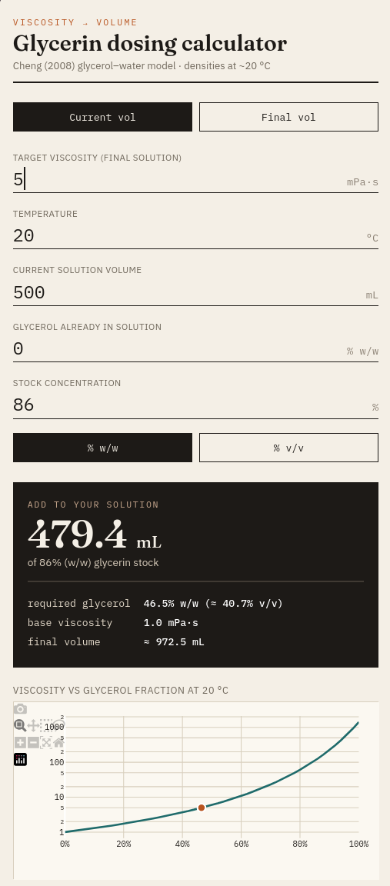
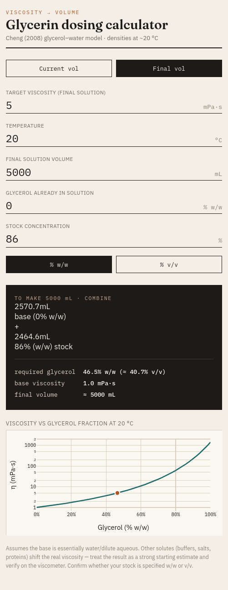

# Glycerin Dosing Calculator

This Glycerin Calculator is developed based on the standard laboratory model proposed by Cheng (2008) for glycerol-water mixtures, specifically for instances when a desired concentration in mPas is required.

FastAPI + HTMX web app for computing glycerin–water dosing to reach a target
viscosity.  
Uses the [**Cheng (2008)**](https://scispace.com/pdf/formula-for-the-viscosity-of-a-glycerol-water-mixture-3x1y9n97is.pdf) glycerol–water viscosity model and tabulated density data spanning 15–30 °C (anchors at 15, 15.5, 20, 25 and 30 °C).

The calculator has two modes, switchable with the toggle at the top of the form.

**First mode — Current volume.** You have a fixed amount of solution on hand.
Enter its volume, the glycerol it already contains, and your target viscosity;
the calculator returns how much glycerin stock to add to reach that viscosity.



**Second mode — Final volume.** You want to prepare a specific batch size. Enter
the desired final volume and target viscosity; the calculator returns the two
volumes to combine — how much base solution and how much glycerin stock — to make
exactly that much solution at the target viscosity. (Because glycerol–water mixing
contracts, the two component volumes sum to slightly more than the final volume;
the result is exact by mass.)



## Quick start

```bash
# install uv if you don't have it
# On macOS and Linux
curl -LsSf https://astral.sh/uv/install.sh | sh

# On Windows
powershell -ExecutionPolicy ByPass -c "irm https://astral.sh/uv/install.ps1 | iex"

# create venv and install deps
uv sync

# run the dev server
uv run glycerin-calculator
# → http://127.0.0.1:8000
```

Or directly:

```bash
uv run uvicorn glycerin_calculator.main:app --reload
```

## Project layout

```
glycerin-calculator/
├── pyproject.toml
├── README.md
├── tests/
│   └── test_calculator.py
└── src/
    └── glycerin_calculator/
        ├── __init__.py
        ├── main.py          # FastAPI app + Plotly chart
        ├── physics.py       # Cheng model, density, unit conversions
        ├── density_data.py  # glycerol–water density tables (15–30 °C)
        ├── static/
        │   └── style.css
        └── templates/
            ├── index.html
            └── partials/
                └── result.html   # HTMX swap target
```

## Running tests

```bash
uv run pytest -v
```

## Model notes

- **Viscosity**: Cheng N-S (2008) *Industrial & Engineering Chemistry Research*.  
  Valid for 0–100 % glycerol and approximately 0–100 °C.
- **Density**: bilinearly interpolated from tabulated literature values —
  piecewise-linear in concentration and linear in temperature between anchor
  tables at 15, 15.5, 20, 25 and 30 °C. Within that band the entered temperature
  is used directly; outside 15–30 °C the value is extrapolated from the nearest
  anchor pair, so verify the density assumption at temperature extremes.
- **Stock basis**: confirm whether your 86% stock is specified w/w or v/v —
  both options are supported via the toggle.

## Changelog

See [CHANGELOG.md](CHANGELOG.md) for release history. Current version: **0.5.0**.

## Dependencies

| Package | Role |
|---|---|
| `fastapi` | HTTP framework |
| `uvicorn` | ASGI server |
| `jinja2` | HTML templating |
| `python-multipart` | form parsing |
| `plotly` | server-side chart JSON |
